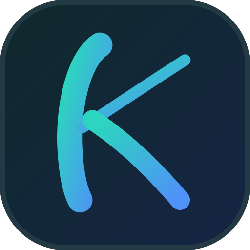

<p align="center">
  
</p>

<h1 align="center">Kavis</h1>

<p align="center">
  Debian tabanlı, Windows benzeri masaüstüne sahip kişisel Linux dağıtımı.<br>
  <i>made by Karan</i>
</p>

---

## Nedir

Debian trixie tabanlı bir masaüstü dağıtımı; bugün amd64 ISO'su üretiliyor, kod çok-mimarili yazılıyor (arm64 hazırlığı — bkz. docs/gorev-listesi.md, MİMARİ ilkesi). Kendi açılış
ekranı, giriş ekranı, görev çubuğu, ayarlar uygulaması ve uygulama mağazası
var. Kendi çekirdeğimizi derlemiyoruz — Debian'ın imzalı çekirdeğini
kullanıyoruz, böylece Secure Boot açık kalabiliyor.

| Konu | Karar |
|---|---|
| Taban | Debian stable (trixie), `live-build` |
| Görüntü sunucusu / WM | X11 + Openbox |
| Kendi yazılımlarımız | Vala → C/GObject (GTK3 + libwnck), tek ikili |
| Kök dosya sistemi | btrfs (`@` + `@users`) |
| Kurulum aracı | Calamares |
| Hedef ISO boyutu | 1.5 GB altı |
| Boşta RAM | 1 GB altı hedef, en fazla 1.5 GB |

## Depo yapısı

```
kavis/
├── assets/       elle konulan kaynak dosyalar (logo, açılış görseli/müziği)
├── docs/         kurulum ve tasarım notları
├── iso/          live-build yapılandırması
├── packages/     kavis-* .deb paketlerinin kaynağı
├── installer/    Calamares yapılandırması + ön kontrol modülü
├── tools/        geliştirme yardımcıları (kontroller, QEMU testi)
└── .github/workflows/   ISO derleme + paket üretimi
```

## Derleme

**ISO yerelde derlenmez.** Derleme ve QEMU testi GitHub Actions'ta yapılır:

GitHub → **Actions** → **"ISO derle ve test et"** → **Run workflow**

Ayrıntılar: [`iso/README.md`](iso/README.md)

Push etmeden önce:

```bash
tools/check-config.sh      # sözdizimi, izinler, YAML
tools/check-packages.sh    # paket adları Debian arşivinde var mı
```

Kendi paketlerimiz yerelde derlenebiliyor (ISO'nun aksine hızlı):

```bash
tools/build-packages.sh          # packages/* → out/packages/*.deb
tools/theme-screenshot.sh        # temayı Xvfb'de çizip PNG'ye al
tools/panel-screenshot.sh        # görev çubuğunu çizip PNG'ye al
```

## Kurulum (GitHub tarafı)

Depolar, GitHub Pages, GPG anahtarı ve secret'lar için:
[`docs/github-kurulumu.md`](docs/github-kurulumu.md)

## Elle konulacak dosyalar

| Dosya | Durum |
|---|---|
| `assets/logo/koyu-k-logo.svg` | ✅ hazır |
| `assets/logo/acik-k-logo.svg` | ✅ hazır |
| `assets/boot/boot-image.png` | ⏳ [özellikler](assets/boot/README.md) |
| `assets/boot/boot-sound.mp3` | ⏳ [özellikler](assets/boot/README.md) |

## Geliştirme sırası

Geliştirme, gruplar hâlinde ilerleyen madde listesine göre yürüyor; hangi
grup bitince hangi sürümün çıkacağı yol haritasında:
[`docs/roadmap.md`](docs/roadmap.md)

Karar günlüğü: [`docs/durum.md`](docs/durum.md) ·
Eski görev tanımı (Karan OS dönemi): [`docs/kavis-claude-code-prompt.md`](docs/kavis-claude-code-prompt.md) ·
Arayüz çevirileri (gettext): [`po/`](po/) ·
GitHub kurulumu: [`docs/github-kurulumu.md`](docs/github-kurulumu.md)

## Çeviri durumu

Kaynak metinler İngilizce; hedef diller [`po/LINGUAS`](po/LINGUAS).
Katkı için bir `<dil>.po` açmak yeter (depo public olunca Weblate da
bağlanacak). Tablo CI tarafından her koşuda güncellenir.

<!-- ceviri-durumu-basla -->
| Dil | Durum |
|---|---|
| `tr` | ▰▰▰▰▰▰▰▰▰▰ %100 (193/193) |
| _çeviri bekleyenler_ | `af` `am` `ar` `az` `be` `bg` `bn` `bs` `ca` `ckb` `cs` `cy` `da` `de` `el` `en_GB` `es` `es_MX` `et` `eu` `fa` `fi` `fr` `ga` `gl` `gu` `he` `hi` `hr` `hu` `hy` `id` `is` `it` `ja` `ka` `kk` `kn` `ko` `ku` `ky` `lt` `lv` `mk` `ml` `mn` `mr` `ms` `nb` `ne` `nl` `pa` `pl` `pt_BR` `pt_PT` `ro` `ru` `si` `sk` `sl` `sq` `sr` `sv` `sw` `ta` `te` `tg` `th` `tk` `tl` `uk` `ur` `uz` `vi` `zh_CN` `zh_TW` `zu` |
<!-- ceviri-durumu-bitir -->
